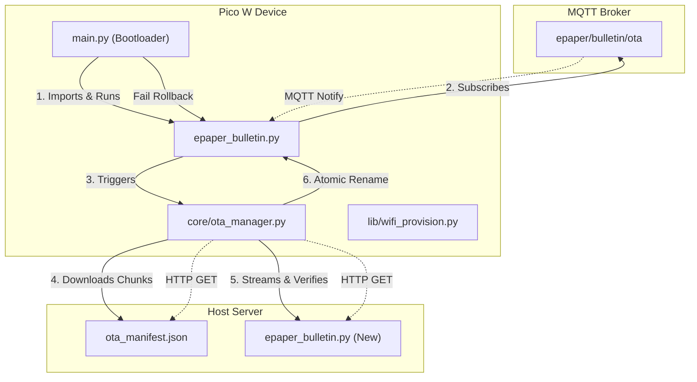
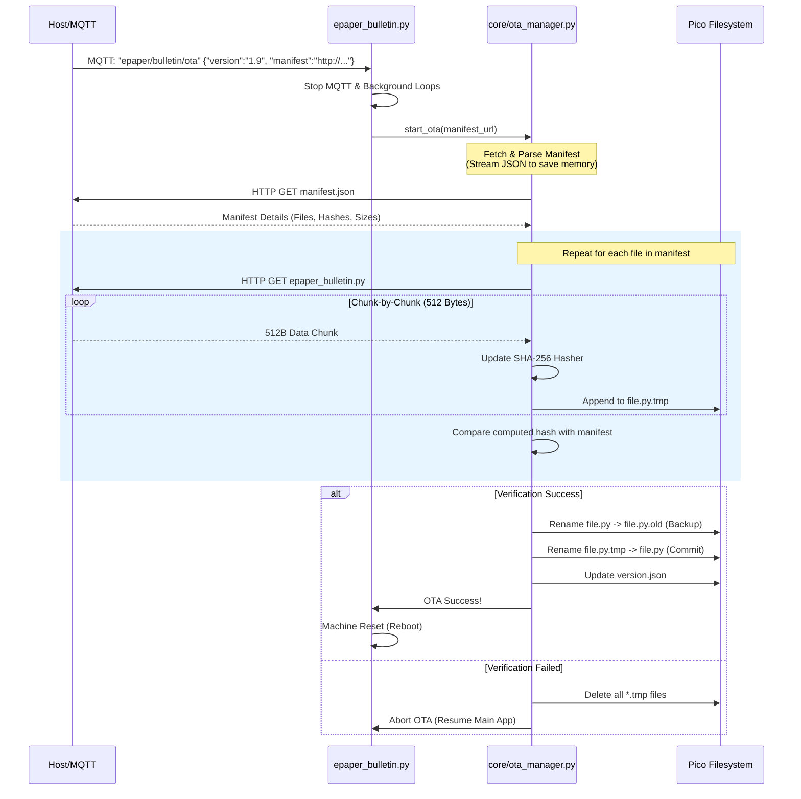

# Waveshare E-Paper Bulletin Board: WiFi OTA 更新方案設計
**文件日期**: 2026-05-18  
**作者**: Antigravity AI  

---

## 1. 前言與設計目標 (Introduction & Design Goals)

在 Raspberry Pi Pico W 這種資源受限（MicroPython 環境，SRAM 僅 264KB）的嵌入式平台上，實作 WiFi Over-The-Air (OTA) 韌體/程式碼更新面臨兩大核心挑戰：
1. **記憶體極度受限 (ENOMEM)**：Waveshare 7.5 吋三色電子紙螢幕解析度達 $800 \times 480$。在三色模式下，黑白與紅色兩個緩衝區靜態佔用了約 **96KB** 記憶體。加上 WiFi 與 MQTT 協定的 TCP 緩衝開銷，剩餘 Heap 往往僅剩 **30KB - 50KB**，無法在記憶體中一次性載入大型程式碼檔案。
2. **防磚保護 (Anti-Brick / Fail-Safe)**：無線傳輸可能因 WiFi 斷線、電源中斷等突發情況失敗。若直接覆寫正在運作的 `epaper_bulletin.py`，一旦寫入不完整，系統將直接「變磚」無法開機。

本方案旨在設計一個**低記憶體佔用、具備自動回滾（Rollback）機制且兼顧主動推送（MQTT）與本地維護（Web UI）的雙軌 OTA 系統**。

---

## 2. 系統架構與流程 (System Architecture & Flow)

我們將 OTA 更新分為兩種觸發模式：
1. **遠端自動更新 (Pull-based HTTP OTA)**：透過 MQTT 發送包含更新清單 URL 的控制指令，Pico W 主動下載並套用更新。
2. **本地緊急恢復 (Push-based Web-UI OTA)**：利用配網 AP 模式下的 Web Server，使用者可透過瀏覽器直接將檔案「推」到 Pico 上。

### 2.1 系統架構圖 (Mermaid Diagram)



### 2.2 OTA 更新主流程圖 (Mermaid Sequence Diagram)



---

## 3. 記憶體優化策略 (Memory Optimization Strategy)

為了確保更新過程不會觸發 `ENOMEM`，我們必須採取以下防護措施：

1. **分段串流寫入 (Socket Streaming)**：
   - 嚴禁使用 `response.text` 或 `response.content` 等一次性將整個 HTTP Body 讀入 RAM 的寫入方式。
   - 使用底層 `usocket` 或 `urequests` 的 raw stream 讀取模式。每次只讀取 **512 Bytes** 到緩衝區，並立即寫入快閃記憶體中的 `.tmp` 檔案，隨後清空緩衝區。
2. **在線雜湊校驗 (On-the-fly Hashing)**：
   - 使用 MicroPython 的 `hashlib.sha256` 進行串流更新：
     ```python
     import hashlib
     h = hashlib.sha256()
     # 每讀取一個 chunk
     h.update(chunk)
     ```
   - 如此可避免在下載完成後重新讀取整個檔案來計算 Hash，節約了檔案 I/O 以及雙倍的記憶體消耗。
3. **主動記憶體回收 (Active Garbage Collection)**：
   - 在啟動 OTA 下載前，主動呼叫 `gc.collect()`。
   - 在每個檔案下載完成後、重命名之前，以及發生錯誤退出時，再度強制作垃圾回收。

---

## 4. 防磚與安全啟動設計 (Anti-Brick & Bootloader Pattern)

為了達成 100% 的系統可靠性，防止設備在無線升級失敗後無法連線，我們設計了 **Bootloader（引導載入器）雙備份與自動回滾機制**。

> [!IMPORTANT]
> **核心設計原則：** 永遠不要將 `epaper_bulletin.py` 作為 Pico 的 `main.py`。
> 應使用一個簡短、容錯率極高的程式碼作為 `main.py`。

### 4.1 引導機制 (`main.py`)
`main.py` 扮演 Bootloader 的角色。它的工作是：
1. 嘗試載入主要程式 `epaper_bulletin.py`。
2. 如果載入失敗（語法錯誤、損壞、缺檔等），捕捉 Exception。
3. 自動觸發回滾：將 `/` 下所有 `.old` 備份檔案還原，並刪除損壞的程式碼。
4. 重新嘗試啟動。如果依然失敗，則自動啟動預備好的 **Recovery AP 模式**（即 WiFi 配網介面，並開啟手動上傳端點）。

### 4.2 檔案原子操作 (Atomic Renaming)
- **第一步：** 所有檔案下載至 `[filename].tmp`。
- **第二步：** 完整性校驗通過後，將現有的執行中檔案 `[filename]` 重命名為 `[filename].old`（此為原子操作，耗時極短且安全）。
- **第三步：** 將 `[filename].tmp` 重命名為 `[filename]`。
- **第四步：** 重新啟動。若新程式順利執行並與 MQTT 伺服器成功通訊 60 秒以上，則刪除 `.old` 備份檔（Commited 狀態）。

### 4.3 硬體看門狗防死鎖 (Hardware Watchdog - WDT)
- 在 Pico W 上啟用硬體看門狗：
  ```python
  from machine import WDT
  wdt = WDT(timeout=8000) # 8 秒逾時
  ```
- 若新程式開機後陷入無限死鎖或 WiFi 連線時卡死，看門狗將在 8 秒後重啟設備。重啟後 Bootloader 發現未成功 Commit，即判定升級失敗，自動執行 Rollback。

---

## 5. 協定與 API 規範 (Protocols & API Spec)

### 5.1 MQTT OTA 控制指令
* **Topic:** `epaper/bulletin/ota`
* **Payload (JSON):**
```json
{
  "version": "1.9.0",
  "manifest_url": "http://192.168.0.96:8000/ota/ota_manifest.json"
}
```

### 5.2 OTA Manifest 檔案規範 (`ota_manifest.json`)
存放在遠端伺服器上，用於指示 Pico 下載哪些檔案及校驗雜湊值：
```json
{
  "version": "1.9.0",
  "min_micro_version": "1.8.0",
  "files": [
    {
      "path": "epaper_bulletin.py",
      "url": "http://192.168.0.96:8000/ota/epaper_bulletin.py",
      "sha256": "4e3a2b1c8f9d0e1b2c3d4e5f6a7b8c9d0e1f2a3b4c5d6e7f8a9b0c1d2e3f4a5b",
      "size": 15674
    },
    {
      "path": "core/wifi_manager.py",
      "url": "http://192.168.0.96:8000/ota/core/wifi_manager.py",
      "sha256": "9b8c7d6e5f4e3d2c1b0a9f8e7d6c5b4a3f2e1d0c9b8a7f6e5d4c3b2a1f0e9d8c",
      "size": 4447
    }
  ]
}
```

### 5.3 本地手動/恢復 API (`/ota-upload`)
我們將在 [lib/wifi_provision.py](file:///home/brandicast/github/waveshare_epaper_bulletin/lib/wifi_provision.py) 中擴充配網網頁伺服器，新增一個極簡且記憶體友善的二進位上傳端點：
* **Method:** `POST`
* **Path:** `/ota-upload?filename=epaper_bulletin.py`
* **Headers:** `Content-Length: <file_size>`
* **Body:** 檔案的**純二進位資料流**（不採用複雜且佔記憶體的 `multipart/form-data`）。

Pico W 處理此請求時，會讀取 HTTP Body，將其串流寫入指定檔名的 `.tmp` 檔案，驗證完成後直接覆寫。

---

## 6. 元件參考實作草案 (Reference Implementation)

### 6.1 Bootloader 引導器 (`main.py` 實作預覽)

我們將在 Pico 的根目錄下佈署此 `main.py`：

```python
# File: main.py
import os
import machine
import utime
import gc

def file_exists(path):
    try:
        os.stat(path)
        return True
    except OSError:
        return False

def rollback():
    print("[Bootloader] 偵測到開機崩潰或異常，啟動復原程序...")
    # 遍歷尋找備份檔案並還原
    files = os.listdir('/')
    # 同時遞迴還原子目錄（如 core/ 等）
    target_dirs = ['', 'core', 'lib']
    for d in target_dirs:
        prefix = (d + '/') if d else ''
        try:
            curr_files = os.listdir('/' + d) if d else os.listdir('/')
            for f in curr_files:
                if f.endswith('.old'):
                    backup_path = prefix + f
                    orig_path = prefix + f[:-4]
                    print("[Bootloader] 還原:", orig_path)
                    try:
                        os.remove(orig_path)
                    except OSError:
                        pass
                    os.rename(backup_path, orig_path)
        except OSError:
            pass
    print("[Bootloader] 回滾完成，嘗試重新開機...")
    machine.reset()

# 標記開機嘗試
boot_flag = "/wifi_config/booting.flag"
try:
    if file_exists(boot_flag):
        # 說明上一次開機在進入主迴圈前重啟了（可能看門狗觸發）
        os.remove(boot_flag)
        rollback()
    
    # 建立 booting 標記檔
    try:
        with open(boot_flag, 'w') as f:
            f.write('1')
    except OSError:
        pass

    # 執行主程式
    import epaper_bulletin
    
except Exception as e:
    print("[Bootloader] 啟動失敗:", e)
    # 移除 booting 標記，避免重複死鎖
    try:
        os.remove(boot_flag)
    except OSError:
        pass
    
    rollback()
```

### 6.2 串流下載器 (`core/ota_manager.py` 實作預覽)

```python
# File: core/ota_manager.py
import usocket
import gc
import os
import hashlib
import machine

class OTAManager:
    def __init__(self):
        pass

    def parse_url(self, url):
        # 簡單解析 http URL
        proto, dummy, host, path = url.split('/', 3)
        port = 80
        if ":" in host:
            host, port = host.split(":")
            port = int(port)
        return host, port, '/' + path

    def download_file(self, url, dest_path, expected_hash, expected_size):
        gc.collect()
        host, port, path = self.parse_url(url)
        
        addr = usocket.getaddrinfo(host, port)[0][-1]
        s = usocket.socket()
        s.settimeout(15)
        
        try:
            s.connect(addr)
            # 發送極簡 HTTP GET 請求
            req = "GET {} HTTP/1.0\r\nHost: {}\r\nUser-Agent: PicoW-OTA\r\n\r\n".format(path, host)
            s.send(bytes(req, 'utf8'))
            
            # 讀取 Response Header
            resp = s.recv(512)
            header_end = resp.find(b'\r\n\r\n')
            if header_end == -1:
                return False
                
            # 確保 HTTP 200 OK
            if b"200 OK" not in resp[:header_end]:
                return False
            
            # 開啟暫存寫入檔案
            tmp_path = dest_path + ".tmp"
            try:
                os.remove(tmp_path)
            except OSError:
                pass
                
            # 分配寫入緩衝區並開始串流
            hasher = hashlib.sha256()
            written_bytes = 0
            
            with open(tmp_path, 'wb') as f:
                # 寫入第一包殘留的 body 資料
                first_body = resp[header_end+4:]
                if first_body:
                    f.write(first_body)
                    hasher.update(first_body)
                    written_bytes += len(first_body)
                
                # 迴圈分段讀取 socket 并寫入快閃記憶體
                while True:
                    chunk = s.recv(512)
                    if not chunk:
                        break
                    f.write(chunk)
                    hasher.update(chunk)
                    written_bytes += len(chunk)
                    
            s.close()
            
            # 驗證大小與雜湊
            computed_hash = hasher.digest()
            # 將 expected_hash (Hex) 轉換為 bytes 比較
            expected_bytes = bytes.fromhex(expected_hash)
            
            if written_bytes != expected_size or computed_hash != expected_bytes:
                print("[OTA] 校驗失敗! 預期大小:", expected_size, "實際:", written_bytes)
                os.remove(tmp_path)
                return False
                
            print("[OTA] 下載成功且校驗通過:", dest_path)
            return True
            
        except Exception as e:
            print("[OTA] 下載發生錯誤:", e)
            s.close()
            return False
        finally:
            gc.collect()
```

### 6.3 本地 Web 網頁上傳 (前端 JS Mockup)

在 [resources/www/index.html](file:///home/brandicast/github/waveshare_epaper_bulletin/resources/www/index.html) 中加入極簡的 OTA 頁籤或隱藏恢復區塊，前端透過 HTML5 File API 配合 `fetch` 發送二進位資料：

```html
<!-- HTML 擴充部分 -->
<div class="card">
    <h3>韌體/程式碼手動更新</h3>
    <input type="file" id="otaFile" />
    <button onclick="uploadOTA()">開始上傳</button>
    <div id="otaStatus"></div>
</div>

<script>
async function uploadOTA() {
    const fileInput = document.getElementById('otaFile');
    const statusDiv = document.getElementById('otaStatus');
    if (!fileInput.files.length) {
        statusDiv.innerText = "請選擇檔案！";
        return;
    }
    const file = fileInput.files[0];
    statusDiv.innerText = "上傳中...";
    
    try {
        // 使用 URL Query 指明目標路徑，Body 直接傳送 Raw File Binary
        const response = await fetch(`/ota-upload?filename=${encodeURIComponent(file.name)}`, {
            method: 'POST',
            headers: {
                'Content-Type': 'application/octet-stream'
            },
            body: file
        });
        if (response.ok) {
            statusDiv.innerText = "上傳成功！系統正在重啟...";
        } else {
            statusDiv.innerText = "上傳失敗，請再試一次。";
        }
    } catch (err) {
        statusDiv.innerText = "連線錯誤: " + err;
    }
}
</script>
```

---

## 7. 更新流程的安全生命週期 (Safety Life-Cycle)

為了讓整體更新萬無一失，完整的生命週期定義如下：

```
[運行中 V1.8] ──> 接收到 MQTT 更新通知 
               │
               ▼
[OTA 狀態] ───> 1. 顯示器畫面切換為 "System Updating..." (通知使用者不要斷電)
               2. 備份原有核心檔案為 *.old (如 epaper_bulletin.py -> epaper_bulletin.py.old)
               3. 依序下載新程式碼為 *.tmp (分段下載，確保記憶體 Heap 不崩潰)
               4. 每一個檔案完成後，比對 SHA-256 與 Manifest
               │
               ├──> [校驗失敗] ──> 刪除 *.tmp ──> 還原 *.old ──> 恢復正常運作
               │
               ▼ [校驗通過]
[原子置換] ───> 1. 刪除舊的 *.old 備份
               2. 重命名 epaper_bulletin.py -> epaper_bulletin.py.old (備份)
               3. 重命名 *.tmp -> 正式檔名
               4. 建立 booting.flag 檔案指示引導器
               5. 重啟系統 (machine.reset())
               │
               ▼
[啟動測試] ───> 1. Bootloader 啟動，嘗試載入新程式碼
               2. 啟動 WDT (看門狗) 防止載入後死鎖
               3. 主迴圈成功運作並與 MQTT 連線 60 秒以上
               ├───> [開機失敗 / 看門狗逾時 / 語法崩潰] 
               │     │
               │     └──> 還原備份: 刪除損壞檔，將 *.old 重命名為正式檔案，移除 booting.flag 重啟
               │
               ▼ [開機成功 (60s)]
[完成提交] ───> 1. 移除 booting.flag
               2. 刪除所有 *.old 備份檔案以釋放 Flash 空間
               3. 顯示新版 Welcome Screen ──> V1.9.0 升級完成！
```

---

## 8. 開發與部署路線圖 (Roadmap)

本方案的整合將分為四個階段，以最小化對現有穩定架構的干擾：

1. **第一階段：部署引導器與 Web 備援**
   - 建立並部署 `main.py` 作為 Bootloader。將原有的入口移出至 `epaper_bulletin.py`。
   - 擴充 [lib/wifi_provision.py](file:///home/brandicast/github/waveshare_epaper_bulletin/lib/wifi_provision.py) 與 [resources/www/index.html](file:///home/brandicast/github/waveshare_epaper_bulletin/resources/www/index.html)，實現本地手動的 `/ota-upload` RAW 上傳功能，先確保有 100% 可控的網頁緊急修復方案。
2. **第二階段：開發串流下載核心**
   - 實作 `core/ota_manager.py`，支援分段 socket 串流下載與 SHA-256 實時雜湊。
   - 在本機 host 電腦建立一個極簡的 HTTP Server，測試 Pico W 從 Host 下載 Manifest 與代碼檔案的穩定性。
3. **第三階段：對接 MQTT 觸發與狀態顯示**
   - 在 [core/mqtt_handler.py](file:///home/brandicast/github/waveshare_epaper_bulletin/core/mqtt_handler.py) 中訂閱 `epaper/bulletin/ota` Topic。
   - 串接 `main_loop`，當接收到 OTA 命令時，繪製系統更新畫面，安全暫停主線程並轉交給 `core/ota_manager.py` 執行升級。
4. **第四階段：全面實測與看門狗壓力測試**
   - 模擬 WiFi 中斷、下載途中斷電、下載語法損壞的 `.py` 檔案等各類異常，驗證看門狗重啟與 Bootloader 自動回滾的功能。

---

> [!TIP]
> **未來展望 (Future Enhancements):**
> 1. **配置檔獨立維護**：確保升級過程中 `/wifi_config/wifi_config.json` 與 `/conf/mqtt.conf` 不會被覆寫。
> 2. **漸進式部分更新**：Manifest 支援增量更新，未變更的檔案（例如體積龐大的圖片資源）不重複下載，最大程度地節省 WiFi 頻寬與 Flash 磨損。
