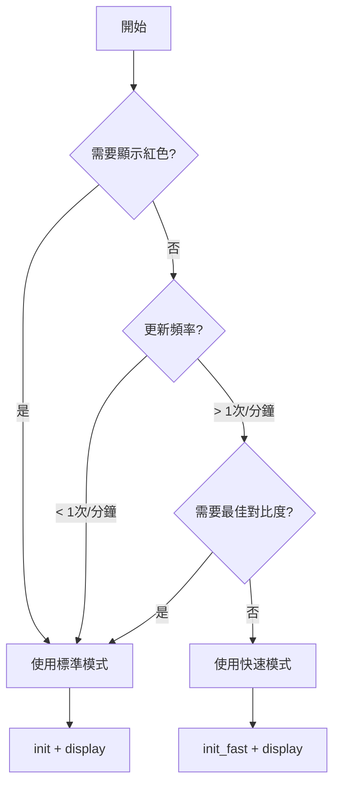

以下是更新後的完整知識文件，已將電源管理模式獨立為一個章節。

---

# 7.5 吋三色電子紙 (黑/白/紅) 知識文件

> 基於 Waveshare 7.5inch e-Paper B V3 與 Raspberry Pi Pico (MicroPython) 的實測經驗整理
> 最後更新：2026-01-11

---

## 目錄

1. [規格摘要](#1-規格摘要)
2. [可用 API 與功能說明](#2-可用-api-與功能說明)
3. [使用範例程式](#3-使用範例程式)
4. [電源管理模式](#4-電源管理模式)
5. [模式使用建議](#5-模式使用建議)
6. [常見問題與注意事項](#6-常見問題與注意事項)

---

## 1. 規格摘要

### 1.1 基本規格

| 項目 | 規格 |
|:---|:---|
| 型號 | Waveshare 7.5inch e-Paper B V3 |
| 解析度 | 800 × 480 像素 |
| 顏色 | 黑、白、紅 (三色) |
| 顯示區域 | 163.2 × 97.92 mm |
| 像素間距 | 0.204 × 0.204 mm |
| 外觀尺寸 | 170.2 × 111.2 × 1.20 mm |
| 重量 | 43.9 ± 0.5 g |
| 通訊介面 | 4-wire SPI (預設) / 3-wire SPI |
| 工作電壓 | VCI: 2.3~3.6V (典型 3.3V) |

### 1.2 電氣特性

| 項目 | 典型值 | 單位 |
|:---|:---|:---|
| 工作電流 | 6.6 | mA |
| Power Off 模式電流 | 20 | μA |
| Deep Sleep 模式電流 | 15 | μA |
| 畫面更新時間 | 15 | 秒 |
| 工作溫度 | 0 ~ 40 | °C |
| 儲存溫度 | -25 ~ 40 | °C |

### 1.3 關鍵特性

- ✅ 雙穩態 (斷電後仍顯示最後畫面)
- ✅ 純反射式顯示 (不發光，類似紙張)
- ✅ 超廣視角
- ✅ 內建顯示 RAM (SRAM)
- ✅ 內建溫度感測器
- ✅ 內建升壓電路 (DC-DC)
- ❌ **不支援真正的局部更新** (局部更新模式僅限黑白且有限制)

### 1.4 硬體接線 (Raspberry Pi Pico)

| E-Paper 腳位 | 名稱 | Pico GPIO |
|:---|:---|:---|
| 14 | DIN (MOSI) | GP11 (SPI1 TX) |
| 13 | CLK (SCK) | GP10 (SPI1 SCK) |
| 12 | CS# | GP9 |
| 11 | D/C# | GP8 |
| 10 | RES# | GP12 |
| 9 | BUSY | GP13 |
| 15 | VDDIO | 3.3V |
| 16 | VCI | 3.3V |
| 17 | VSS | GND |

---

## 2. 可用 API 與功能說明

### 2.1 類別初始化

```python
from machine import Pin, SPI
import framebuf
import utime

epd = EPD_7in5_B(spi_bus=1, rst=12, dc=8, cs=9, busy=13, mode="normal")
```

| 參數 | 預設值 | 說明 |
|:---|:---|:---|
| `spi_bus` | 1 | SPI 匯流排編號 (0 或 1) |
| `rst` | 12 | 重置腳位 |
| `dc` | 8 | 資料/指令選擇腳位 |
| `cs` | 9 | 片選腳位 |
| `busy` | 13 | 忙碌狀態腳位 |
| `mode` | "normal" | 初始化模式: "normal" / "fast" / "partial" |

### 2.2 初始化模式

| 方法 | 說明 | 使用場景 |
|:---|:---|:---|
| `init()` | 標準初始化 (預設) | 一般使用，最穩定 |
| `init_fast()` | 快速初始化 | 犧牲少許對比度換取速度 |
| `init_partial()` | 局部更新模式初始化 | 僅限黑白區域更新 (不建議) |

### 2.3 畫面操作 API

| 方法 | 說明 | 注意 |
|:---|:---|:---|
| `clear(color)` | 清除畫面為單一顏色 | `color`: "white"/"black"/"red" |
| `display()` | 將 buffer 資料刷新到螢幕 | 會等待 BUSY 完成 |
| `display_preconverted(bw, red)` | 顯示預轉換的影像資料 | 最快方式 |
| `display_bmp(filename, x, y)` | 顯示 1-bit 單色 BMP | 僅黑白 |
| `display_bmp_color(filename, x, y)` | 顯示彩色 BMP (轉換為三色) | 速度較慢 |

### 2.4 電源管理 API (詳細說明見第 4 章)

| 方法 | 功耗 | 資料保留 | 喚醒方式 |
|:---|:---|:---|:---|
| `power_off()` | ~20 μA | ✅ 保留 | `power_on()` |
| `deep_sleep()` | ~15 μA | ❌ 清除 | 硬體重置 |
| `sleep()` | ~15 μA | ❌ 清除 | 硬體重置 (相容 Waveshare) |

### 2.5 繪圖 API (使用 FrameBuffer)

| 方法 | 說明 |
|:---|:---|
| `imageblack.pixel(x, y, color)` | 設定黑白像素 (0=黑, 1=白) |
| `imagered.pixel(x, y, color)` | 設定紅色像素 (0=無紅, 1=紅) |
| `imageblack.fill(color)` | 填滿黑白 buffer |
| `imagered.fill(color)` | 填滿紅色 buffer |
| `imageblack.text(text, x, y, color)` | 繪製文字 (僅黑白) |
| `imagered.text(text, x, y, color)` | 繪製文字 (僅紅色) |
| `set_pixel(x, y, color)` | 設定單一像素 (0=黑,1=白,2=紅) |
| `draw_rect(x, y, w, h, color, fill)` | 繪製矩形 |
| `draw_line(x0, y0, x1, y1, color)` | 繪製直線 |
| `draw_circle(xc, yc, r, color, fill)` | 繪製圓形 |

### 2.6 效能優化 API

| 方法 | 說明 | 參數範圍 |
|:---|:---|:---|
| `set_spi_speed(baudrate)` | 調整 SPI 速率 | 1M ~ 10M Hz |
| `set_voltage(vgh, vdh, vdl)` | 調整驅動電壓 | 見下表 |

**電壓設定參數：**

| 參數 | 選項 | 影響 |
|:---|:---|:---|
| VGH/VGL | 9V ~ 20V | 越高對比度越好，越耗電 |
| VDH | 10V ~ 15V | 影響黑白顯示品質 |
| VDL | -10V ~ -15V | 影響黑白顯示品質 |

---

## 3. 使用範例程式

### 3.1 完整可用程式碼

```python
"""
7.5inch e-Paper B V3 完整控制程式
Raspberry Pi Pico / MicroPython
"""

from machine import Pin, SPI
import framebuf
import utime

# ==================== 顯示解析度 ====================
EPD_WIDTH = 800
EPD_HEIGHT = 480

# ==================== 預設腳位 ====================
RST_PIN = 12
DC_PIN = 8
CS_PIN = 9
BUSY_PIN = 13


class EPD_7in5_B:
    # 顏色常數
    BLACK = 0
    WHITE = 1
    RED = 2
    
    def __init__(self, spi_bus=1, rst=RST_PIN, dc=DC_PIN, cs=CS_PIN, busy=BUSY_PIN, mode="normal"):
        self.rst_pin = Pin(rst, Pin.OUT)
        self.dc_pin = Pin(dc, Pin.OUT)
        self.cs_pin = Pin(cs, Pin.OUT)
        self.busy_pin = Pin(busy, Pin.IN, Pin.PULL_UP)
        
        self.width = EPD_WIDTH
        self.height = EPD_HEIGHT
        
        # SPI 初始化
        self.spi = SPI(spi_bus)
        self.spi.init(baudrate=4000000, polarity=0, phase=0)
        
        # 雙 buffer
        self.buffer_black = bytearray(self.height * self.width // 8)
        self.buffer_red = bytearray(self.height * self.width // 8)
        self.imageblack = framebuf.FrameBuffer(
            self.buffer_black, self.width, self.height, framebuf.MONO_HLSB)
        self.imagered = framebuf.FrameBuffer(
            self.buffer_red, self.width, self.height, framebuf.MONO_HLSB)
        
        # 根據模式選擇初始化
        if mode == "fast":
            self.init_fast()
        elif mode == "partial":
            self.init_partial()
        else:
            self.init()
        
        print(f"初始化完成 - 模式: {mode}")
    
    # ==================== 底層通訊 ====================
    def _digital_write(self, pin, value):
        pin.value(value)
    
    def _digital_read(self, pin):
        return pin.value()
    
    def _delay_ms(self, ms):
        utime.sleep(ms / 1000.0)
    
    def _send_command(self, cmd):
        self._digital_write(self.dc_pin, 0)
        self._digital_write(self.cs_pin, 0)
        self.spi.write(bytearray([cmd]))
        self._digital_write(self.cs_pin, 1)
    
    def _send_data(self, data):
        self._digital_write(self.dc_pin, 1)
        self._digital_write(self.cs_pin, 0)
        self.spi.write(bytearray([data]))
        self._digital_write(self.cs_pin, 1)
    
    def _send_data_bytes(self, data_bytes):
        self._digital_write(self.dc_pin, 1)
        self._digital_write(self.cs_pin, 0)
        self.spi.write(data_bytes)
        self._digital_write(self.cs_pin, 1)
    
    def _reset(self):
        self._digital_write(self.rst_pin, 1)
        self._delay_ms(200)
        self._digital_write(self.rst_pin, 0)
        self._delay_ms(2)
        self._digital_write(self.rst_pin, 1)
        self._delay_ms(200)
    
    def _wait_until_idle(self):
        while self._digital_read(self.busy_pin) == 0:
            self._delay_ms(10)
        self._delay_ms(10)
    
    def _turn_on_display(self):
        self._send_command(0x12)  # DISPLAY REFRESH
        self._delay_ms(100)
        self._wait_until_idle()
    
    # ==================== 初始化模式 ====================
    def init(self):
        """標準初始化 (Waveshare 官方，最穩定)"""
        self._reset()
        
        self._send_command(0x01)  # POWER SETTING
        self._send_data(0x07)
        self._send_data(0x07)
        self._send_data(0x3f)
        self._send_data(0x3f)
        
        self._send_command(0x06)  # BOOSTER SOFT START
        self._send_data(0x17)
        self._send_data(0x17)
        self._send_data(0x28)
        self._send_data(0x17)
        
        self._send_command(0x04)  # POWER ON
        self._delay_ms(100)
        self._wait_until_idle()
        
        self._send_command(0x00)  # PANEL SETTING
        self._send_data(0x0F)
        
        self._send_command(0x61)  # RESOLUTION (800x480)
        self._send_data(0x03)
        self._send_data(0x20)
        self._send_data(0x01)
        self._send_data(0xE0)
        
        self._send_command(0x50)  # VCOM INTERVAL
        self._send_data(0x11)
        self._send_data(0x07)
        
        self._send_command(0x60)  # TCON
        self._send_data(0x22)
    
    def init_fast(self):
        """快速初始化 (犧牲少許對比度)"""
        self._reset()
        
        self._send_command(0x00)
        self._send_data(0x0F)
        
        self._send_command(0x04)
        self._delay_ms(100)
        self._wait_until_idle()
        
        self._send_command(0x06)
        self._send_data(0x27)
        self._send_data(0x27)
        self._send_data(0x18)
        self._send_data(0x17)
        
        self._send_command(0xE0)
        self._send_data(0x02)
        self._send_command(0xE5)
        self._send_data(0x5A)
        
        self._send_command(0x50)
        self._send_data(0x11)
        self._send_data(0x07)
        
        self._send_command(0x61)
        self._send_data(0x03)
        self._send_data(0x20)
        self._send_data(0x01)
        self._send_data(0xE0)
        
        self._send_command(0x60)
        self._send_data(0x22)
    
    def init_partial(self):
        """局部更新模式初始化 (僅限黑白，不穩定，不建議使用)"""
        self._reset()
        
        self._send_command(0x00)
        self._send_data(0x1F)
        
        self._send_command(0x04)
        self._delay_ms(100)
        self._wait_until_idle()
        
        self._send_command(0xE0)
        self._send_data(0x02)
        self._send_command(0xE5)
        self._send_data(0x6E)
        
        self._send_command(0x50)
        self._send_data(0xA9)
        self._send_data(0x07)
    
    # ==================== 基本畫面操作 ====================
    def clear(self, color="white"):
        """清除畫面 (white/black/red)"""
        if color == "white":
            self.imageblack.fill(0xFF)
            self.imagered.fill(0x00)
        elif color == "black":
            self.imageblack.fill(0x00)
            self.imagered.fill(0x00)
        elif color == "red":
            self.imageblack.fill(0xFF)
            self.imagered.fill(0xFF)
        self.display()
    
    def display(self):
        """將 buffer 資料刷新到螢幕"""
        high = self.height
        wide = self.width // 8 if self.width % 8 == 0 else self.width // 8 + 1
        
        # 發送黑白資料
        self._send_command(0x10)
        for i in range(wide):
            start = i * high
            end = (i + 1) * high
            self._send_data_bytes(self.buffer_black[start:end])
        
        # 發送紅色資料
        self._send_command(0x13)
        for i in range(wide):
            start = i * high
            end = (i + 1) * high
            self._send_data_bytes(self.buffer_red[start:end])
        
        self._turn_on_display()
    
    # ==================== 電源管理模式 ====================
    def power_off(self):
        """
        關閉電源 (Power Off)
        
        行為:
            - 關閉升壓電路、驅動器
            - 保留 SRAM 和暫存器資料
            - 功耗約 20 μA
        
        喚醒方式:
            呼叫 power_on() 即可恢復
        
        適用場景:
            - 短時間待機 (幾分鐘到幾小時)
            - 需要快速恢復顯示
        """
        self._send_command(0x02)  # POWER OFF
        self._wait_until_idle()
        print("Power Off: 電源已關閉，資料保留")
    
    def power_on(self):
        """
        從 Power Off 喚醒
        
        注意:
            - 喚醒後 buffer 資料仍然存在
            - 可直接呼叫 display() 刷新畫面
        """
        self._send_command(0x04)  # POWER ON
        self._delay_ms(100)
        self._wait_until_idle()
        print("Power On: 已喚醒，資料已恢復")
    
    def deep_sleep(self):
        """
        深度睡眠 (Deep Sleep)
        
        行為:
            - 關閉所有電路 (包括 SRAM)
            - 僅保留暫存器設定
            - 功耗約 15 μA (最低)
        
        喚醒方式:
            只能透過硬體重置 (RESET pin)
        
        適用場景:
            - 長時間不使用 (幾小時到幾天)
            - 電池供電設備
        """
        self._send_command(0x02)  # 先關閉電源
        self._wait_until_idle()
        self._send_command(0x07)  # DEEP SLEEP
        self._send_data(0xA5)     # 檢查碼 (必須)
        print("Deep Sleep: 進入深度睡眠，需硬體重置喚醒")
    
    def wake_from_deep_sleep(self):
        """
        從 Deep Sleep 喚醒 (需要硬體重置)
        
        注意:
            - 會清除所有 buffer 資料
            - 需要重新傳送影像
        """
        self._reset()      # 硬體重置
        self.init()        # 重新初始化
        print("Deep Sleep 喚醒完成，請重新傳送影像資料")
    
    def sleep(self):
        """
        相容 Waveshare 官方 sleep() 函式
        實際執行 Power Off + Deep Sleep
        """
        self.deep_sleep()
    
    # ==================== BMP 影像顯示 ====================
    def display_bmp(self, filename, x=0, y=0):
        """
        顯示 1-bit 單色 BMP 檔案 (黑白)
        
        參數:
            filename: BMP 檔案名稱
            x, y: 顯示位置 (左上角)
        
        限制:
            - 僅支援 1-bit 單色 BMP
            - 建議尺寸不超過 800x480
        """
        try:
            with open(filename, 'rb') as f:
                header = f.read(54)
                
                if header[0] != 0x42 or header[1] != 0x4D:
                    print("錯誤：不是有效的 BMP 檔案")
                    return False
                
                data_offset = int.from_bytes(header[10:14], 'little')
                width = int.from_bytes(header[18:22], 'little')
                height = int.from_bytes(header[22:26], 'little')
                bit_count = int.from_bytes(header[28:30], 'little')
                
                print(f"BMP 資訊: {width}x{height}, {bit_count} bits/pixel")
                
                if bit_count != 1:
                    print("警告：建議使用 1-bit 單色 BMP")
                
                row_bytes = (width + 7) // 8
                padding = (4 - (row_bytes % 4)) % 4
                
                f.seek(data_offset)
                
                for row in range(height):
                    screen_y = y + (height - 1 - row)
                    if screen_y < 0 or screen_y >= self.height:
                        f.read(row_bytes + padding)
                        continue
                    
                    row_data = f.read(row_bytes + padding)
                    
                    for col in range(width):
                        screen_x = x + col
                        if screen_x < 0 or screen_x >= self.width:
                            continue
                        
                        byte_idx = col // 8
                        bit_pos = 7 - (col % 8)
                        if byte_idx < len(row_data):
                            pixel = (row_data[byte_idx] >> bit_pos) & 1
                            color = self.BLACK if pixel == 0 else self.WHITE
                            self.set_pixel(screen_x, screen_y, color)
            
            return True
            
        except Exception as e:
            print(f"BMP 讀取錯誤: {e}")
            return False
    
    def display_bmp_color(self, filename, x=0, y=0, red_threshold=128):
        """
        顯示 24-bit 彩色 BMP 檔案 (自動轉換為黑/白/紅)
        """
        try:
            with open(filename, 'rb') as f:
                header = f.read(54)
                
                if header[0] != 0x42 or header[1] != 0x4D:
                    print("錯誤：不是有效的 BMP 檔案")
                    return False
                
                data_offset = int.from_bytes(header[10:14], 'little')
                width = int.from_bytes(header[18:22], 'little')
                height = int.from_bytes(header[22:26], 'little')
                bit_count = int.from_bytes(header[28:30], 'little')
                
                print(f"BMP 資訊: {width}x{height}, {bit_count} bits/pixel")
                
                if bit_count != 24:
                    if bit_count == 1:
                        return self.display_bmp(filename, x, y)
                    print(f"警告：建議使用 24-bit BMP")
                
                row_bytes = width * 3
                padding = (4 - (row_bytes % 4)) % 4
                
                f.seek(data_offset)
                
                for row in range(height):
                    screen_y = y + (height - 1 - row)
                    if screen_y < 0 or screen_y >= self.height:
                        f.read(row_bytes + padding)
                        continue
                    
                    row_data = f.read(row_bytes + padding)
                    
                    for col in range(width):
                        screen_x = x + col
                        if screen_x < 0 or screen_x >= self.width:
                            continue
                        
                        b = row_data[col * 3]
                        g = row_data[col * 3 + 1]
                        r = row_data[col * 3 + 2]
                        
                        if r > g and r > b and r > red_threshold:
                            color = self.RED
                        else:
                            brightness = (r * 299 + g * 587 + b * 114) // 1000
                            color = self.BLACK if brightness < 128 else self.WHITE
                        
                        self.set_pixel(screen_x, screen_y, color)
            
            return True
            
        except Exception as e:
            print(f"BMP 讀取錯誤: {e}")
            return False
    
    def display_preconverted(self, bw_data, red_data=None):
        """
        顯示預先轉換好的影像資料 (最快)
        """
        if len(bw_data) != len(self.buffer_black):
            print(f"錯誤：黑白資料長度不符 (需 {len(self.buffer_black)} bytes)")
            return False
        
        self.buffer_black[:] = bw_data
        
        if red_data:
            if len(red_data) != len(self.buffer_red):
                print(f"錯誤：紅色資料長度不符 (需 {len(self.buffer_red)} bytes)")
                return False
            self.buffer_red[:] = red_data
        else:
            for i in range(len(self.buffer_red)):
                self.buffer_red[i] = 0
        
        return True
    
    # ==================== 繪圖輔助 ====================
    def set_pixel(self, x, y, color):
        """設定單一像素 (0=黑,1=白,2=紅)"""
        if x < 0 or x >= self.width or y < 0 or y >= self.height:
            return
        if color == self.BLACK:
            self.imageblack.pixel(x, y, 0)
            self.imagered.pixel(x, y, 0)
        elif color == self.WHITE:
            self.imageblack.pixel(x, y, 1)
            self.imagered.pixel(x, y, 0)
        elif color == self.RED:
            self.imageblack.pixel(x, y, 1)
            self.imagered.pixel(x, y, 1)
    
    def draw_rect(self, x, y, w, h, color, fill=False):
        """繪製矩形"""
        if fill:
            for i in range(x, min(x + w, self.width)):
                for j in range(y, min(y + h, self.height)):
                    self.set_pixel(i, j, color)
        else:
            for i in range(x, min(x + w, self.width)):
                self.set_pixel(i, y, color)
                if h > 1:
                    self.set_pixel(i, min(y + h - 1, self.height - 1), color)
            if h > 2:
                for j in range(y + 1, min(y + h - 1, self.height)):
                    self.set_pixel(x, j, color)
                    if w > 1:
                        self.set_pixel(min(x + w - 1, self.width - 1), j, color)
    
    def draw_line(self, x0, y0, x1, y1, color):
        """Bresenham 直線演算法"""
        dx = abs(x1 - x0)
        dy = -abs(y1 - y0)
        sx = 1 if x0 < x1 else -1
        sy = 1 if y0 < y1 else -1
        err = dx + dy
        
        while True:
            self.set_pixel(x0, y0, color)
            if x0 == x1 and y0 == y1:
                break
            e2 = 2 * err
            if e2 >= dy:
                err += dy
                x0 += sx
            if e2 <= dx:
                err += dx
                y0 += sy
    
    def draw_circle(self, xc, yc, r, color, fill=False):
        """繪製圓形"""
        if fill:
            for y in range(-r, r + 1):
                w = int((r * r - y * y) ** 0.5)
                for x in range(-w, w + 1):
                    self.set_pixel(xc + x, yc + y, color)
        else:
            x = 0
            y = r
            d = 3 - 2 * r
            while x <= y:
                self.set_pixel(xc + x, yc + y, color)
                self.set_pixel(xc - x, yc + y, color)
                self.set_pixel(xc + x, yc - y, color)
                self.set_pixel(xc - x, yc - y, color)
                self.set_pixel(xc + y, yc + x, color)
                self.set_pixel(xc - y, yc + x, color)
                self.set_pixel(xc + y, yc - x, color)
                self.set_pixel(xc - y, yc - x, color)
                if d < 0:
                    d = d + 4 * x + 6
                else:
                    d = d + 4 * (x - y) + 10
                    y -= 1
                x += 1
    
    # ==================== 效能優化 ====================
    def set_spi_speed(self, baudrate):
        """動態調整 SPI 速率 (預設 4MHz，最高可到 10MHz)"""
        self.spi.init(baudrate=baudrate, polarity=0, phase=0)
        print(f"SPI 速率設為 {baudrate} Hz")
    
    def set_voltage(self, vgh="20V", vdh="15V", vdl="-15V"):
        """調整驅動電壓 (影響對比度與功耗)"""
        vgh_table = {"9V": 0x00, "10V": 0x01, "11V": 0x02, "12V": 0x03,
                     "17V": 0x04, "18V": 0x05, "19V": 0x06, "20V": 0x07}
        
        vdh_table = {10: 0x28, 11: 0x2C, 12: 0x30, 13: 0x34, 14: 0x38, 15: 0x3C}
        vdl_table = {-10: 0x28, -11: 0x2C, -12: 0x30, -13: 0x34, -14: 0x38, -15: 0x3C}
        
        self._send_command(0x01)
        self._send_data(0x07)
        self._send_data(vgh_table.get(vgh, 0x07))
        self._send_data(vdh_table.get(vdh, 0x3F))
        self._send_data(vdl_table.get(vdl, 0x3F))
        print(f"電壓設定: VGH/VGL={vgh}, VDH={vdh}V, VDL={vdl}V")


# ==================== 範例主程式 ====================
if __name__ == '__main__':
    epd = EPD_7in5_B(mode="normal")
    
    print("=== 開始測試 ===\n")
    
    # 1. 基本繪圖測試
    print("1. 基本繪圖測試...")
    epd.clear("white")
    epd.imageblack.text("Hello Waveshare!", 10, 10, 0x00)
    epd.imagered.text("7.5 inch e-Paper", 10, 40, 0xFF)
    epd.draw_rect(10, 70, 200, 100, epd.BLACK, fill=False)
    epd.draw_rect(20, 80, 180, 80, epd.RED, fill=True)
    epd.display()
    utime.sleep(3)
    
    # 2. 幾何圖形測試
    print("\n2. 幾何圖形測試...")
    epd.clear("white")
    epd.draw_circle(400, 240, 100, epd.BLACK, fill=False)
    epd.draw_circle(400, 240, 50, epd.RED, fill=True)
    epd.draw_line(0, 0, 799, 479, epd.BLACK)
    epd.draw_line(0, 479, 799, 0, epd.RED)
    epd.display()
    utime.sleep(3)
    
    # 3. 電源管理測試
    print("\n3. 電源管理測試...")
    print("   進入 Power Off 模式 3 秒...")
    epd.power_off()
    utime.sleep(3)
    print("   從 Power Off 喚醒...")
    epd.power_on()
    epd.display()
    utime.sleep(2)
    
    # 4. 清除並進入深度睡眠
    print("\n4. 清除畫面並進入深度睡眠...")
    epd.clear("white")
    epd.deep_sleep()
    
    print("\n=== 測試完成 ===")
```

---

## 4. 電源管理模式

### 4.1 兩種電源模式對比

電子紙提供兩種省電模式，功耗和行為有明顯差異：

| 項目 | Power Off | Deep Sleep |
|:---|:---|:---|
| **指令** | `0x02` (POWER_OFF) | `0x07` (DEEP_SLEEP) |
| **功耗** | ~20 μA | ~15 μA |
| **SRAM 資料保留** | ✅ 保留 | ❌ 不保留 |
| **暫存器保留** | ✅ 保留 | ✅ 保留 |
| **喚醒方式** | `power_on()` 指令 | 硬體重置 (RESET) |
| **喚醒後畫面** | 可直接 `display()` | 需重新傳送影像 |
| **使用場景** | 短時間待機 | 長時間不使用 |

### 4.2 API 說明

| 方法 | 說明 | 喚醒方式 |
|:---|:---|:---|
| `power_off()` | 關閉電源，保留資料 | `power_on()` |
| `power_on()` | 從 Power Off 喚醒 | - |
| `deep_sleep()` | 深度睡眠，最低功耗 | 硬體重置 |
| `wake_from_deep_sleep()` | 從 Deep Sleep 喚醒 | - |
| `sleep()` | 相容 Waveshare 官方 | 硬體重置 |

### 4.3 使用範例

```python
# ===== 方式 1: Power Off (短時間待機) =====
epd.display()           # 顯示畫面
epd.power_off()         # 關閉電源 (20μA)
utime.sleep(60)         # 待機 1 分鐘
epd.power_on()          # 喚醒
epd.display()           # 直接顯示 (資料還在)

# ===== 方式 2: Deep Sleep (長時間待機) =====
epd.display()           # 顯示畫面
epd.deep_sleep()        # 深度睡眠 (15μA)
# ... 數小時後 ...
epd.wake_from_deep_sleep()  # 硬體重置喚醒
epd.clear("white")           # 需要重新傳送資料
epd.display()

# ===== 方式 3: Waveshare 相容模式 =====
epd.sleep()             # 等同於 deep_sleep()
```

### 4.4 選擇建議

| 情境 | 建議模式 | 原因 |
|:---|:---|:---|
| 電子貨架標籤 | Power Off | 可能隨時需要更新 |
| 電子時鐘 (每分鐘更新) | Power Off | 快速喚醒 |
| 電子書閱讀器 | Deep Sleep | 長時間閱讀同一頁 |
| 電池供電感測器節點 | Deep Sleep | 數小時才更新一次 |
| 展示看板 | 不進入睡眠 | 雙穩態不耗電 |
| 需要顯示紅色 | Power Off | 紅色喚醒後可直接顯示 |

### 4.5 快速參考

```
┌─────────────────────────────────────────────────────────────┐
│                    電源管理模式選擇                          │
├─────────────────────────────────────────────────────────────┤
│                                                             │
│  下次更新在 5 分鐘內?                                        │
│      ├── 是 → power_off()   (功耗 20μA，快速喚醒)           │
│      │      喚醒: power_on() + display()                    │
│      │                                                      │
│      └── 否 → deep_sleep()  (功耗 15μA，最省電)             │
│             喚醒: 硬體重置 + 重新初始化 + 重新傳送資料        │
│                                                             │
│  重要提醒:                                                   │
│  - power_off() 後 buffer 資料保留，可直接 display()         │
│  - deep_sleep() 後 buffer 資料消失，需重新傳送影像           │
│  - Waveshare 的 sleep() 實際上是 deep_sleep()               │
│                                                             │
└─────────────────────────────────────────────────────────────┘
```

---

## 5. 模式使用建議

### 5.1 三種初始化模式對比

| 模式 | 初始化方法 | 刷新時間 | 對比度 | 適用場景 |
|:---|:---|:---|:---|:---|
| **標準模式** | `init()` | ~15秒 | 最佳 | 一般用途 (預設) |
| **快速模式** | `init_fast()` | ~12秒 | 略降 | 頻繁更新 |
| **局部模式** | `init_partial()` | ~5-10秒 | 較差 | 黑白區域更新 (不建議) |

### 5.2 使用決策樹



### 5.3 電源管理結合使用

```python
class BatteryOptimizedEPD(EPD_7in5_B):
    """電池供電最佳化版本"""
    
    def update_and_sleep(self, next_update_seconds=60):
        """更新畫面後自動選擇合適的睡眠模式"""
        self.display()
        
        if next_update_seconds < 300:  # 5分鐘內會再更新
            self.power_off()
            print(f"Power Off: {next_update_seconds} 秒後將喚醒")
        else:
            self.deep_sleep()
            print(f"Deep Sleep: {next_update_seconds} 秒後需硬體重置")
```

### 5.4 各場景最佳實踐

| 應用場景 | 推薦初始化模式 | 推薦電源模式 | 額外建議 |
|:---|:---|:---|:---|
| 電子貨架標籤 | 標準模式 | Power Off | 更新後立即睡眠 |
| 電子時鐘 | 快速模式 | Power Off | 只更新數字區域 |
| 電子看板 | 標準模式 | 不睡眠 | 降低電壓延長壽命 |
| 電池供電設備 | 標準模式 | Deep Sleep | 務必使用睡眠模式 |
| 頻繁更新 (每分鐘) | 快速模式 | Power Off | 調高幀率到 10Hz |
| 展示靜態圖片 | 標準模式 | 不睡眠 | 可完全不供電 |

### 5.5 不建議使用的功能

| 功能 | 原因 | 替代方案 |
|:---|:---|:---|
| 局部更新 (`init_partial`) | 僅限黑白、限制多、不穩定 | 使用黑白電子紙或標準模式 |
| 3-wire SPI | 需要額外處理 D/C 位元 | 使用 4-wire SPI (預設) |
| 自訂 LUT 波形 | 複雜、易出錯、可能損壞面板 | 使用內建 OTP LUT |
| Pico 即時轉換彩色圖片 | 記憶體不足、速度極慢 | 預先在電腦端轉換 |

---

## 6. 常見問題與注意事項

### 6.1 畫面沒反應？

請依序檢查：
1. 確認所有接線正確 (特別是 BUSY 和 RST)
2. 確認電子紙模組有獨立供電 (Pico 的 3.3V 可能不足)
3. 確認 SPI 速率不超過 10MHz
4. 確認已呼叫 `display()` 而不是只修改 buffer

### 6.2 顯示殘影或鬼影？

- 這是電子紙的正常現象
- 解決方法：執行一次完整的 `clear("white")` 再重新顯示
- 預防：避免頻繁局部更新

### 6.3 紅色顯示不純或偏淡？

- 檢查 `init()` 是否正確執行
- 確認紅色資料寫入 `imagered` buffer 而非 `imageblack`
- 嘗試調高 VDH 電壓 (15V 為典型值)

### 6.4 更新時間太長？

- 這是電子紙的物理限制 (約 15 秒)
- 無法大幅縮短
- 如需快速更新，請改用 TFT LCD 或 OLED

### 6.5 記憶體不足？

- 雙 buffer 約需要 (800×480/8)×2 = 96KB
- Pico 有 264KB RAM，足夠使用
- 如仍不足，可考慮壓縮或分段傳輸

### 6.6 為什麼需要預處理轉換？

| 原因 | 說明 |
|:---|:---|
| 記憶體限制 | Pico 只有 264KB RAM，無法儲存完整彩色圖片 (1.15MB) |
| 處理速度 | 384,000 個像素的即時轉換會耗費數十秒 |
| 格式支援 | Pico 無法解壓縮 PNG/JPG，只能讀取 BMP |
| 顏色轉換 | 需要複雜的算法將彩色轉為黑/白/紅三色 |
| 空間效率 | 預處理後 96KB vs 原始 1.15MB，節省 92% 空間 |

### 6.7 重要注意事項

| 事項 | 說明 |
|:---|:---|
| ⚠️ 不要頻繁刷新 | 每分鐘超過 1 次可能影響壽命 |
| ⚠️ 避免彎折 FPC | 排線脆弱，易斷裂 |
| ⚠️ 防靜電 | 操作前觸摸金屬接地 |
| ⚠️ 儲存環境 | 23±3°C, 55±10% RH |
| ⚠️ 避免陽光直射 | 會加速面板老化 |

---

## 附錄 A：指令表快速參考

| 指令 | 代碼 | 說明 |
|:---|:---|:---|
| PANEL_SETTING | 0x00 | 面板模式設定 |
| POWER_SETTING | 0x01 | 電源設定 |
| POWER_OFF | 0x02 | 關閉電源 |
| POWER_ON | 0x04 | 開啟電源 |
| BOOSTER_SOFT_START | 0x06 | 升壓軟啟動 |
| DEEP_SLEEP | 0x07 | 深度睡眠 |
| DTM1 | 0x10 | 黑白資料傳輸 |
| DISPLAY_REFRESH | 0x12 | 畫面刷新 |
| DTM2 | 0x13 | 紅色資料傳輸 |
| PLL_CONTROL | 0x30 | PLL 頻率控制 |
| VCOM_INTERVAL | 0x50 | VCOM 間隔設定 |
| RESOLUTION | 0x61 | 解析度設定 |

---

## 附錄 B：版本歷史

| 日期 | 版本 | 說明 |
|:---|:---|:---|
| 2026-01-11 | v1.0 | 初始版本，基於實測結果整理 |
| 2026-01-11 | v1.1 | 新增電源管理模式獨立章節，補充 Power Off 與 Deep Sleep 差異 |

---

*本文件可作為後續開發的參考，避免重複查閱規格書與除錯。*